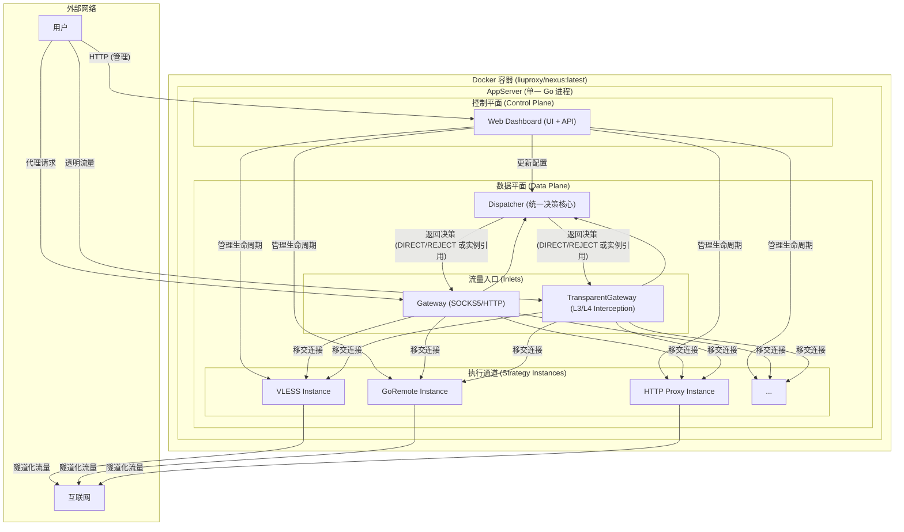

# LiuProxy Nexus v4.0 - 架构与愿景

本文档是 `liuproxy_nexus` 项目的顶层设计蓝图，是项目的“宪法”。它定义了项目的最终愿景、核心架构和关键设计决策，是所有后续开发和功能迭代的指导原则。

## 1. 项目愿景 (Vision)

`liuproxy_nexus` 的最终愿景是成为一个**一体化的、自包含的智能网络网关**。它将作为一个单一的 Go 程序（并以 Docker 镜像形式）交付，为从个人用户到家庭、小型办公室的各种场景，提供强大而易于管理的网络连接与安全解决方案。

通过一个统一的 Web 管理界面，用户可以轻松配置复杂的网络行为，包括：

*   **多协议代理**: 无缝接入 `Go Remote`, `VLESS`, `Cloudflare Worker`, `HTTP Proxy` 等多种后端。
*   **智能分流**: 基于域名、IP、协议等丰富条件，将流量自动导向最优通道或执行特定策略（直连/拒绝）。
*   **透明网关**: 为整个局域网提供服务，无需在每台设备上单独配置，并支持 TCP 和 UDP 流量。
*   **网络安全**: 提供基于规则的防火墙功能，对流量进行访问控制。
*   **可观测性**: 提供实时的流量监控和统计仪表盘。

最终目标是实现 **“一次配置，全局生效”**，将复杂的网络管理任务简化为直观的 Web 界面操作。

## 2. 核心架构 (Architecture)

系统由一个**单一主进程 (`AppServer`)** 驱动，该进程内部集成了两种网关入口，并由一个统一的决策核心 (`Dispatcher`) 进行智能分流。

### 2.1. 双模式网关 (Dual-Mode Gateway)

`liuproxy_nexus` 通过两个并行的网关组件，实现了两种截然不同的工作模式：

1.  **转发代理模式 (Forward Proxy Mode)**:
    *   **入口**: `Gateway` 模块，监听一个标准端口（如 `9099`）。
    *   **工作方式**: 接收来自应用程序（如浏览器、移动 App）明确配置的 SOCKS5/HTTP 代理请求。
    *   **场景**: 个人 PC、移动端 App 等需要精细化代理控制的场景。

2.  **透明网关模式 (Transparent Gateway Mode)**:
    *   **入口**: `TransparentGateway` 模块，监听一个用于接收重定向流量的内部端口。
    *   **工作方式**: 配合操作系统的网络规则（如 `iptables`），拦截局域网内设备的**所有或特定**网络流量。用户设备**无需任何配置**。
    *   **场景**: 作为家庭或办公室的中央网关，为所有设备（手机、电视、IoT 设备）提供无感知的智能分流和安全防护。

### 2.2. 内部逻辑架构

## 3. 核心设计决策 (Key Decisions)

1.  **Go 原生与单一进程**: 整个系统由一个单一的 Go 二进制文件驱动，内部实现了所有功能，包括 Web 服务器、双模式网关和所有代理协议。这彻底摒弃了对 `HAProxy`, `supervisord` 等外部进程的依赖，极大地简化了部署和维护。

2.  **废弃 `localPort`，采用实例引用**: `Dispatcher` 在做出路由决策后，不再返回一个本地地址（如 `"127.0.0.1:10810"`），而是直接返回**策略实例 (`Strategy Instance`) 的对象引用**。网关组件直接调用该实例的方法来处理连接，移除了内部 TCP 通信的开销，提升了性能并从根本上简化了配置。

3.  **配置与运行时的分离 (A/B 区)**: UI 上的配置变更首先保存在“配置区”（A 区），并通过一个明确的“应用变更”操作，才会原子性地更新到“工作区”（B 区）。此设计避免了在持有锁的同时执行耗时操作，确保了系统的并发稳定性和 UI 的高响应性。

4.  **Docker-First 部署**: 透明网关模式的核心能力依赖于底层的网络操控，因此其主要部署平台被定为 **Linux**，并通过 **Docker** 进行打包和分发。容器需要 `NET_ADMIN` 权限来配置 `iptables` 规则。

5.  **统一配置模型**:
    *   `configs/liuproxy.ini`: 存储**程序静态行为**配置（如 Web UI 端口、日志级别），这些配置在启动后通常不会改变。
    *   `configs/settings.json`: 存储**所有动态策略**，包括网关设置（粘性会话、负载均衡）、路由规则、防火墙规则等。此文件完全由 Web UI 管理，并支持热重载。

---