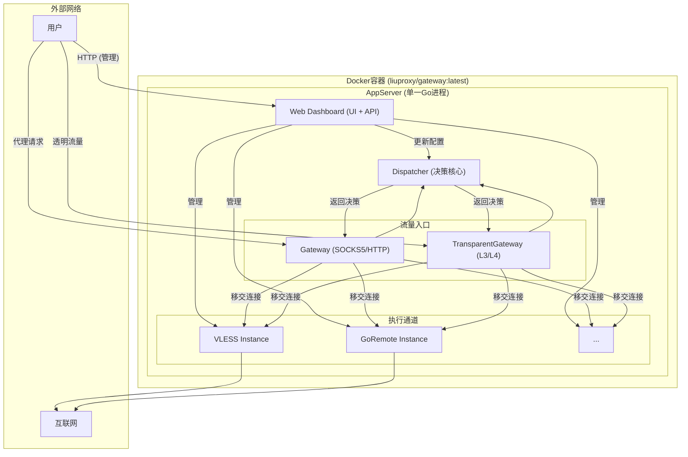

# LiuProxy v3.0 - 项目愿景与架构蓝图

## 1. 项目最终愿景 (Project Vision)

`LiuProxy v3.0` 的最终愿景是成为一个**一体化的、自包含的智能网络网关**。它将作为一个单一的Go程序（或Docker镜像）交付，为从个人用户到家庭、小型办公室的各种场景，提供强大而易于管理的网络连接与安全解决方案。

通过一个统一的Web管理界面，用户可以轻松配置复杂的网络行为，包括：
*   **多协议代理**: 无缝接入 `Go Remote`, `VLESS`, `Cloudflare Worker` 等多种后端。
*   **智能分流**: 基于域名、IP、地理位置等丰富条件，将流量自动导向最优通道。
*   **透明网关**: 为整个局-域网提供服务，无需在每台设备上单独配置。
*   **网络安全**: 提供基础的防火墙和流量审计功能。

最终目标是实现“一次配置，全局生效”，将复杂的网络管理任务简化为直观的Web界面操作。

---

## 2. 核心模块与最终职责定义 (一体化架构)

项目将整合为一个**单一主进程**，内部包含所有核心模块，彻底摒弃对 `HAProxy`, `supervisord` 等外部进程的依赖。

**a. `AppServer` (主进程)**
*   **定位**: 整个系统的**心脏与大脑**，是唯一的运行实体。
*   **职责**:
    *   托管 **Web Dashboard**，作为系统的控制平面。
    *   管理所有**策略实例 (`Strategy Instances`)** 的生命周期。
    *   启动并管理 `Gateway` 和 `TransparentGateway` 两个流量入口。

**b. `Gateway` & `TransparentGateway` (统一流量入口)**
*   **定位**: 系统的**数据平面入口**，完全由Go原生实现。
*   **职责**:
    *   `Gateway` 负责监听标准代理端口，处理来自**主动配置代理**的应用程序的SOCKS5/HTTP请求。
    *   `TransparentGateway` 配合底层网络规则（如 `iptables`），负责拦截**透明流量**，实现对整个网络的无感知代理。
    *   将解析出的连接元数据（源IP、目标地址）统一提交给 `Dispatcher` 进行决策。

**c. `Dispatcher` (智能路由核心)**
*   **定位**: 系统的**决策核心**。
*   **职责**:
    *   根据 `settings.json` 中定义的防火墙和路由规则，对每一个请求进行智能分析和决策。
    *   将决策结果（如 `DIRECT`, `REJECT` 或具体的策略实例）返回给流量入口。

**d. `Strategy Instances` (隧道执行器)**
*   **定位**: 数据的**执行通道**，负责与远程服务器的实际通信。
*   **职责**:
    *   实现各种代理协议（GoRemote, VLESS, Worker 等）。
    *   直接接管由 `Gateway` 或 `TransparentGateway` 传递过来的 `net.Conn` 连接，并将其隧道化。

**e. `liuproxy-android-app` (移动端)**
*   **定位**: 保持作为安卓平台上的**独立、全功能**客户端。
*   **职责**: 使用 `AppServer` 提供的标准SOCKS5服务。

---

## 3. 最终架构设计

**a. 部署形态**:
*   系统以一个**单一、轻量级的Docker镜像** (`liuproxy/gateway:latest`) 交付。
*   镜像内只包含一个 `liuproxy-go` 二进制文件及其配置文件。
*   容器通过 `NET_ADMIN` 权限启动，以启用透明网关功能。

**b. 配置文件系统**:
*   `configs/liuproxy.ini`: 存储**程序静态行为**配置（如Web UI端口、日志级别）。
*   `configs/settings.json`: 存储**所有动态策略**，包括网关设置（粘性会-话、负载均衡）、路由规则、防火墙规则等。完全由Web UI管理。

**c. 内部逻辑架构 (单一进程内部)**
