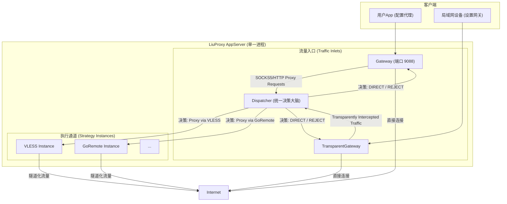

# LiuProxy v3.0 - 项目规划与架构设计

## 1. 核心愿景

`LiuProxy v3.0`旨在成为一个**模块化、跨平台的统一网络网关解决方案**。它以一个强大的Go核心为基础，通过双模式架构，既能作为**应用层转发代理**（为PC、移动端App提供SOCKS5/HTTP服务），也能作为一个真正的**传统网络网关**（为整个局域网提供透明代理、防火墙和流量监控）。

该系统通过支持多种后端协议，为用户在不同网络环境下提供了兼具性能、灵活性的选择，并最终整合为一个单一、易于部署的一体化Docker镜像。

---

## 2. 系统架构

系统由一个**单一主进程 (`AppServer`)** 驱动，该进程内部集成了两种网关入口，并由一个统一的决策核心 (`Dispatcher`) 进行智能分流。

### 2.1. 双模式网关 (Dual-Mode Gateway)

`LiuProxy` 通过两个并行的网关组件，实现了两种截然不同的工作模式：

1.  **转发代理模式 (Forward Proxy Mode)**:
    *   **入口**: `Gateway` 模块，监听一个标准端口（如 `9088`）。
    *   **工作方式**: 接收来自应用程序（如浏览器）明确配置的SOCKS5/HTTP代理请求。
    *   **场景**: 个人PC、移动端App等需要精细化代理控制的场景。

2.  **透明网关模式 (Transparent Gateway Mode)**:
    *   **入口**: `TransparentGateway` 模块，监听一个用于接收重定向流量的内部端口。
    *   **工作方式**: 配合操作系统的路由表或防火墙规则（如 `iptables`），拦截局域网内设备的**所有或特定**网络流量。用户设备**无需任何配置**。
    *   **场景**: 作为家庭或办公室的中央网关，为所有设备（手机、电视、IoT设备）提供无感知的智能分流和安全防护。

### 2.2. 内部逻辑架构

    
### 2.3. 核心设计决策

*   **废弃 `localPort`**: `Dispatcher` 在做出路由决策后，不再返回一个本地地址（如 `"127.0.0.1:10810"`），而是直接返回**策略实例 (`Strategy Instance`) 的对象引用**。网关组件直接调用该实例的方法来处理连接，移除了内部TCP通信的开销，提升了性能和简化了配置。
*   **部署环境**: 透明网关模式的核心能力依赖于底层的网络操控，因此其主要部署平台被定为 **Linux**（物理机或虚拟机），并通过**Docker**进行打包和分发，需要 `NET_ADMIN` 权限。
*   **统一配置**: `configs/settings.json` 是所有动态配置的唯一来源，未来将扩展以支持防火墙规则的定义。

---

## 3. 核心功能模块详解

### 3.1. 后端支持 (Backends)

| 后端类型      | 协议      | TCP支持 | UDP支持 | 备注                                                      |
| ------------- | --------- | ------- | ------- | --------------------------------------------------------- |
| **Go Remote** | 自研 v3.1 | ✅       | ✅       | **性能最佳**，全功能，唯一原生支持UDP的后端。              |
| **Worker**    | 自研 v2.2 | ✅       | ❌       | 仅支持TCP。利用Cloudflare网络，高可用。                   |
| **VLESS**     | 标准VLESS | ✅       | ❌       | 仅支持TCP。用于接入现有VLESS生态，兼容性强。              |

### 3.2. 智能分流 (`Dispatcher`)

`Dispatcher` 是系统的“大脑”，负责所有路由决策，其逻辑对两种网关模式完全通用。

*   **输入**: 连接的元数据（源IP、原始目标地址）。
*   **处理**:
    1.  **防火墙规则匹配 (新增)**: （仅限透明网关模式）首先匹配 `firewall` 规则，决定是 `ALLOW` 还是 `DENY`。
    2.  **路由规则匹配**: 对 `ALLOW` 的流量，继续匹配 `routing` 规则列表（基于数值优先级）。
    3.  **默认行为**: 如果没有任何路由规则匹配，则执行默认的负载均衡策略。
*   **输出**: 一个明确的执行指令（如 `DIRECT`, `REJECT`，或一个具体的 `Strategy Instance` 引用）。
    
### 3.3. Android APP

*   **定位**: 保持作为独立的、全功能的**转发代理客户端**。它使用 `Gateway` 提供的标准SOCKS5服务，而不直接参与透明网关模式。
